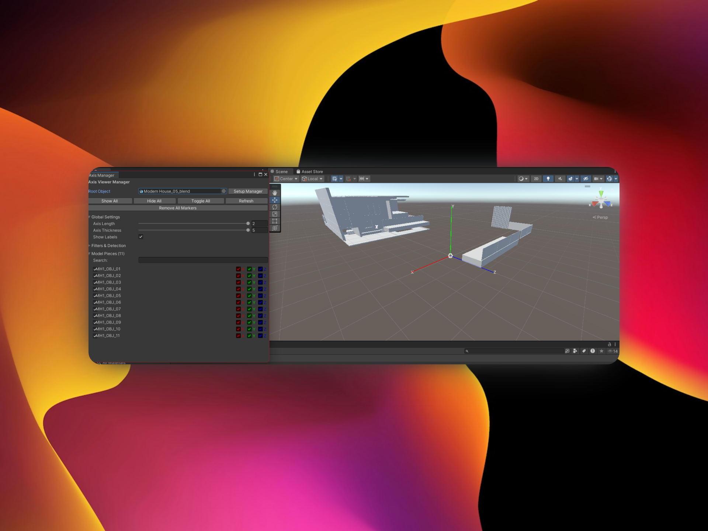

# Advanced Axis Marker Plugin for Unity

A complete plugin to visualize coordinate axes (X, Y, Z) of all objects in a 3D model, both in editor and runtime.


*The plugin in action showing the advanced Axis Manager Window with individual piece control and real-time axis visualization*

## Key Features

### ✨ Functionality
- **Axis Visualization**: Shows X (red), Y (green), Z (blue) axes with arrows and labels
- **Individual Control**: Enable/disable axes per piece and per individual axis
- **Automatic Detection**: Automatically finds all pieces of a model
- **Editor & Runtime**: Works both in Unity editor and during runtime
- **Complete Interface**: Advanced editor window and runtime UI
- **Smart Filters**: Filter objects by Renderer, Collider, names, etc.
- **Presets**: Predefined configurations for different use cases

### 🎯 Use Cases
- Object orientation debugging
- Coordinate system visualization
- Education and 3D concept demonstration
- Development tools for teams
- Complex model analysis

## Installation

1. Copy the `Assets/Plugins/ObjectAxesViewer` folder to your project
2. Unity will automatically compile the scripts
3. Access the plugin from `Window > Axis Viewer Manager`

## Quick Start

### In Editor

1. **Open the Manager Window**:
   - Go to `Window > Axis Viewer Manager`

2. **Setup a Model**:
   - Select your root object in "Root Object"
   - Click "Setup Manager"
   - The plugin will automatically detect all pieces

3. **Control Visualization**:
   - Use "Show All", "Hide All", "Toggle All" for global control
   - Use individual toggles for each piece
   - Control X, Y, Z axes individually

### In Runtime

1. **Automatic Setup**:
   ```csharp
   // Add to any GameObject
   ModelAxisManager manager = AxisUtilities.SetupAxisMarkersForModel(myModel);
   RuntimeAxisController controller = AxisUtilities.CreateRuntimeController(manager, true);
   ```

2. **Programmatic Control**:
   ```csharp
   // Show/hide all axes
   manager.ShowAllAxes();
   manager.HideAllAxes();
   
   // Control specific piece
   manager.SetPieceVisibility("PieceName", true);
   
   // Global configuration
   manager.globalAxisLength = 1.0f;
   manager.UpdateGlobalSettings();
   ```

## System Components

### 🔧 Main Components

#### `AxisMarkerImproved`
- Base component that draws axes on a GameObject
- Individual control of X, Y, Z axes
- Color, size and label configuration
- Works with `OnDrawGizmos` for editor visualization

#### `ModelAxisManager`
- Manages all axis markers of a model
- Automatic piece detection
- Global configuration and filters
- Complete API for programmatic control

#### `RuntimeAxisController`
- Runtime user interface
- Automatically creates UI Canvas
- Interactive controls for end users
- Complete integration with ModelAxisManager

### 🎨 Editor Tools

#### `ImprovedAxisManagerWindow`
- Advanced editor window (`Window > Axis Viewer Manager`)
- Complete piece list with search
- Real-time global configuration
- Filtering and selection tools

#### `ModelAxisManagerEditor`
- Custom inspector for ModelAxisManager
- Quick controls and statistics
- Advanced selection tools
- Quick configuration presets

## Advanced Configuration

### Detection Filters

```csharp
ModelAxisManager manager = GetComponent<ModelAxisManager>();

// Configure filters
manager.filterByRenderer = true;      // Only objects with Renderer
manager.filterByCollider = false;     // Include objects without Collider
manager.includeInactivePieces = true; // Include inactive objects

// Exclude objects by name
manager.AddExcludeName("Helper");
manager.AddExcludeName("Temp");

// Apply changes
manager.DetectModelPieces();
```

### Custom Presets

```csharp
// Use predefined presets
var preset = AxisUtilities.Presets.Large;
preset.ApplyToMarker(axisMarker);

// Create custom preset
var customPreset = new AxisUtilities.AxisPreset
{
    name = "My Preset",
    axisLength = 0.8f,
    axisThickness = 4f,
    showLabels = true,
    xAxisColor = Color.magenta
};
```

### Color Configuration

```csharp
// Change colors globally
foreach(var piece in manager.ModelPieces)
{
    AxisUtilities.SetCustomAxisColors(
        piece.axisMarker, 
        Color.cyan,    // X
        Color.yellow,  // Y  
        Color.magenta  // Z
    );
}
```

## Runtime API

### Basic Control

```csharp
// Get the manager
ModelAxisManager manager = FindObjectOfType<ModelAxisManager>();

// Show/hide all
manager.ShowAllAxes();
manager.HideAllAxes();
manager.ToggleAllAxes();

// Control by piece
manager.SetPieceVisibility("Wheel1", true);
manager.SetPieceVisibility("Engine", false);

// Find pieces
ModelPiece piece = manager.GetPieceByName("Chassis");
List<ModelPiece> visible = manager.GetVisiblePieces();
```

### Dynamic Configuration

```csharp
// Change global configuration
manager.globalAxisLength = 1.5f;
manager.globalAxisThickness = 3f;
manager.showLabels = false;
manager.UpdateGlobalSettings();

// Configure specific piece
var marker = manager.GetPieceByName("Piece1").axisMarker;
marker.SetAxisVisibility(true, false, true); // Only X and Z
marker.axisLength = 0.3f;
```

### Events and Callbacks

```csharp
// Detect changes (implement as needed)
public class AxisEventHandler : MonoBehaviour
{
    private ModelAxisManager manager;
    
    void Start()
    {
        manager = GetComponent<ModelAxisManager>();
    }
    
    void Update()
    {
        // Example: Toggle with key
        if (Input.GetKeyDown(KeyCode.Space))
        {
            manager.ToggleAllAxes();
        }
        
        // Example: Control by number
        for (int i = 1; i <= 9; i++)
        {
            if (Input.GetKeyDown(KeyCode.Alpha0 + i) && i <= manager.ModelPieces.Count)
            {
                var piece = manager.ModelPieces[i-1];
                piece.isVisible = !piece.isVisible;
                piece.axisMarker.showAxis = piece.isVisible;
            }
        }
    }
}
```

## Debugging Tools

```csharp
// Manager information
AxisUtilities.DebugTools.LogAxisManagerInfo(manager);

// List all pieces
AxisUtilities.DebugTools.LogAllPieces(manager);

// Find all managers in scene
var allManagers = AxisUtilities.FindAllAxisManagers();
foreach(var mgr in allManagers)
{
    Debug.Log($"Manager found: {mgr.name}");
}
```

## Best Practices

### 🎯 Performance
- Use filters to reduce unnecessary markers
- Disable labels if you don't need them
- Consider using "Small" presets for complex models

### 🎨 Visualization
- Adjust `axisLength` according to your model size
- Use contrasting colors for better visibility
- Enable only the axes you need to see

### 🔧 Development
- Use `ModelAxisManager` as the main component
- Implement `RuntimeAxisController` for user interfaces
- Take advantage of presets for quick configurations

## Troubleshooting

### Axes not visible
- Verify that `showAxis` is enabled
- Check that the object has an `AxisMarkerImproved`
- Make sure `axisLength` is appropriate for your scale

### Slow performance
- Reduce the number of active markers
- Disable labels if you don't need them
- Use more restrictive filters

### Runtime UI doesn't appear
- Verify that `RuntimeAxisController` is configured
- Check that `createUIAutomatically` is enabled
- Make sure there's an `EventSystem` in the scene

## Extensions and Customization

The plugin is designed to be extensible. You can:

- Create new marker types by inheriting from `AxisMarkerImproved`
- Implement configuration save/load systems
- Add new detection filters
- Create custom user interfaces
- Integrate with other visualization systems

## License

This plugin is free to use for personal and commercial projects.

---

**Need help?** Check the example scripts in the `Runtime` folder or consult the comments in the source code.
